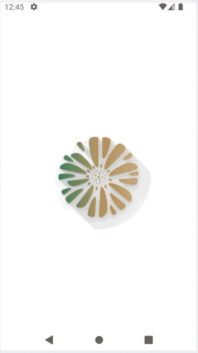
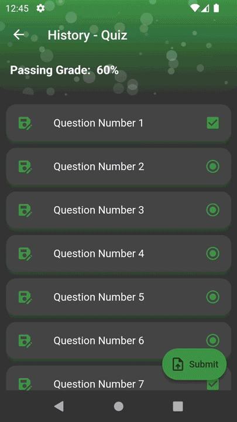
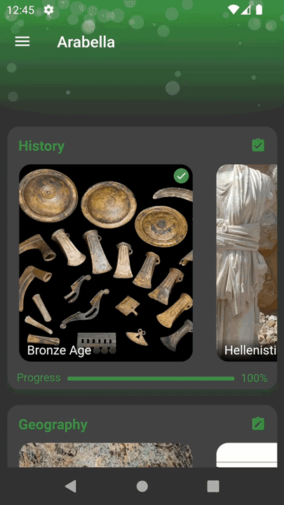
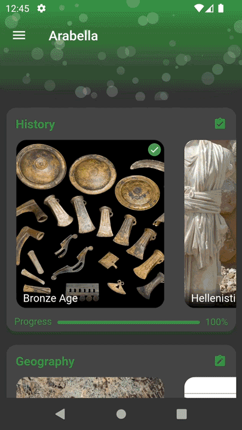

Arabella
==============================
This is a submission for the **competition** of the **best application that introduces the city of Irbid**.

The APK builds (split by ABI) can be found [here](build/app/outputs/flutter-apk).

# Table of Contents

* [Organizers](#organizers)
* [Getting Started](#getting-started)
* [Project Structure](#project-structure)
* [Utilized Packages](#utilized-packages)
* [Main Features](#main-features)
* [Screens](#screens)
* [Customization](#customization)

## Organizers

<table>
   <tr>
      <td></td>
      <td>
         <h3>Jordan University of Science & Technology</h3>
      </td>
   </tr>
   <tr>
      <td></td>
      <td>
         <h3>Ministry of Culture</h3>
      </td>
   </tr>
   <tr>
      <td></td>
      <td>
         <h3>Arab Capital of Culture Initiative - Irbid</h3>
      </td>
   </tr>
</table>

## Getting Started

Clone the project from GitHub

```bash
$ git clone https://github.com/tariqshaban/arabella.git
```

Import all dependencies

```bash
$ flutter pub get
```

Create/modify the `local.properties` file in order to successfully compile the project

```properties
#google_maps_flutter plugin mandates a minimum Android SDK version of 20
flutter.minSdkVersion=20
#Learn more about API keys here https://developers.google.com/maps/documentation/embed/get-api-key
googleMapsApiKey=YOUR_API_KEY
```

> **Warning**: Building the package will **FAIL** if the above parameters were not provided.

Run application

```bash
$ flutter run
```

> **Note**: The project was developed on Flutter 3.0.5 (stable).

## Project Structure

    ├── README.md                                                 <- README file for developers using this project
    │
    ├── assets
    │   │── images
    │   │   │── drawer_circular                                   <- Store circular navigation drawer images
    │   │   │── intro                                             <- Store intro screen images
    │   │   └── markers                                           <- Store theme-sensitive map markers
    │   │── maps                                                  <- Store theming configuration for Google maps
    │   │── readme                                                <- Store images for the README file
    │   │── translations                                          <- Store localization strings
    │   └── remote_assets.zip                                     <- Copy of assets that are stored remotely
    │
    ├── lib
    │   │── assets
    │   │   │── components
    │   │   │   │── custom
    │   │   │   │   │── custom_expansion_tile.dart                <- Modified ExpansionTile widget
    │   │   │   │   └── fullscreen_widget.dart                    <- Modified full_screen_image_null_safe plugin
    │   │   │   │── assets_download_state.dart                    <- Handles assets state represented by a card
    │   │   │   │── expandable_widget.dart                        <- Wrapper for the custom_expansion_tile widget
    │   │   │   │── extended_floating_action_button.dart          <- Direction-aware floating action button
    │   │   │   │── intro.dart                                    <- Encapsulates the introduction screen
    │   │   │   │── learning_description.dart                     <- Used on the chapter page
    │   │   │   │── learning_outcomes.dart                        <- Used on the chapter page
    │   │   │   │── learning_progress.dart                        <- Used on the chapter page
    │   │   │   │── lesson_list.dart                              <- Used on the home page
    │   │   │   │── lesson_list_vertical.dart                     <- Used on the chapter page
    │   │   │   │── navigation_drawer.dart                        <- A navigation drawer that is used on the home page
    │   │   │   │── paging_scroll_physics.dart                    <- helper class for the parallax effect
    │   │   │   │── parallax.dart                                 <- Achieved parallax effect for a list of images
    │   │   │   │── point_of_interest_info.dart                   <- Merely displays a point/polyline/polygon info
    │   │   │   │── points_of_interest.dart                       <- Encapsulates the Google map widget
    │   │   │   │── question_state.dart                           <- Handles a question state represented by an icon
    │   │   │   └── snack_bar.dart                                <- Merely displays a snackbar
    │   │   │── enums
    │   │   │   │── assets_state.dart                             <- Enumerates the current state of the remote assets
    │   │   │   └── map_annotation_type.dart                      <- Enumerates the type of the point of interest on map
    │   │   │── helpers
    │   │   │   │── delayed_curve.dart                            <- Custom linear, but delayed curved
    │   │   │   │── dynamic_tr.dart                               <- Get word translation from the delayed remote assets
    │   │   │   └── shader_callback_helper.dart                   <- Shader mask for the header overlaying illusion
    │   │   └── models
    │   │   │   │── providers
    │   │   │   │   │── answered_questions_provider.dart          <- Provides the state of the chapter's questions
    │   │   │   │   │── assets_provider.dart                      <- Provides the state of the assets (downloading, ...)
    │   │   │   │   │── background_animation_provider.dart        <- Provides the state of the background animation
    │   │   │   │   │── celebrate_provider.dart                   <- Provides the state of the celebration flag
    │   │   │   │   │── chapters_provider.dart                    <- Provides the state of the chapter loading
    │   │   │   │   │── confetti_provider.dart                    <- Provides the state of the confetti configuration
    │   │   │   │   │── covered_material_provider.dart            <- Provides the state of the finished material
    │   │   │   │   │── expandable_widget_state_provider.dart     <- Provides the state of the expansion flag
    │   │   │   │   │── intro_provider.dart                       <- Provides the state of the intro visibility flag
    │   │   │   │   │── maps_icon_provider.dart                   <- Provides the state of the dynamic map icon
    │   │   │   │   │── post_navigation_animation_provider.dart   <- Provides the state of the splash animation flag
    │   │   │   │   │── scroll_direction_provider.dart            <- Provides the state of the scroll status (for FAB)
    │   │   │   │   │── selected_color_provider.dart              <- Provides the state of the selected theme color
    │   │   │   │   └── theme_provider.dart                       <- Provides the state of the theme data object
    │   │   │   │── chapter_model.dart                            <- Encapsulates the chapter as a model
    │   │   │   │── question_model.dart                           <- Encapsulates the question as a model
    │   │   │   └── quiz_metadata.dart                            <- Encapsulates the quiz as a model
    │   │── badge.dart                                            <- Displays earned badges
    │   │── chapter.dart                                          <- Displays a selected chapter's progress and lessons
    │   │── home.dart                                             <- Displays an array of chapters with their lessons
    │   │── lesson.dart                                           <- Displays a lesson (markdown file and map)
    │   │── main.dart                                             <- Entry point, contains settings (theme, routes, ...)
    │   │── question.dart                                         <- Display a selected question number with its options
    │   │── quiz.dart                                             <- Displays a list of questions
    │   └── splash.dart                                           <- Visible entry points, handles remote assets updates
    │
    └── pubspec.yaml                                              <- Specify required packages and assets folder to load

## Utilized Packages

| Package (on [Pub.dev](https://pub.dev))                                               | Description (from package's page)                                                                                                                                                    | Usage                                                                        |
|---------------------------------------------------------------------------------------|--------------------------------------------------------------------------------------------------------------------------------------------------------------------------------------|------------------------------------------------------------------------------|
| [`adaptive_theme`](https://pub.dev/packages/adaptive_theme)                           | Allows to change between light and dark theme dynamically and add system adaptive theme support.                                                                                     | Handling light/dark theme                                                    |
| [`easy_localization`](https://pub.dev/packages/easy_localization)                     | Easy and Fast internationalizing and localization your Flutter Apps, this package simplify the internationalizing process .                                                          | Handing languages and localization                                           |
| [`provider`](https://pub.dev/packages/provider)                                       | A wrapper around InheritedWidget to make them easier to use and more reusable.                                                                                                       | Handing the state of the app                                                 |
| [`flutter_markdown`](https://pub.dev/packages/flutter_markdown)                       | A Markdown renderer for Flutter. Create rich text output, including text styles, tables, links, and more, from plain text data formatted with simple Markdown tags.                  | Handling the display on lessons, quizzes, and questions                      |
| [`shared_preferences`](https://pub.dev/packages/shared_preferences)                   | Flutter plugin for reading and writing simple key-value pairs. Wraps NSUserDefaults on iOS and SharedPreferences on Android.                                                         | Handling the persistence of the application                                  |
| [`confetti`](https://pub.dev/packages/confetti)                                       | Blast colorful confetti all over the screen. Celebrate in app achievements with style. Control the velocity, angle, gravity and amount of confetti.                                  | Handling the confetti animation upon passing a quiz                          |
| [`google_maps_flutter`](https://pub.dev/packages/google_maps_flutter)                 | A Flutter plugin for integrating Google Maps in iOS and Android applications.                                                                                                        | Handling the display of Google maps in each lesson                           |
| [`animated_background`](https://pub.dev/packages/animated_background)                 | Animated Backgrounds for Flutter. Easily extended to paint whatever you want on the canvas.                                                                                          | Handling the animation that is located on the top of the screen              |
| [`image`](https://pub.dev/packages/image)                                             | Provides server and web apps the ability to load, manipulate, and save images with various image file formats including PNG, JPEG, GIF, BMP, WebP, TIFF, TGA, PSD, PVR, and OpenEXR. | Handling the generating of a theme-aware map marker                          |
| [`liquid_progress_indicator`](https://pub.dev/packages/liquid_progress_indicator)     | A progress indicator with water-like effect in Flutter. Works similarly to Flutters own ProgressIndicator.                                                                           | Handling the progress indicator located on the chapter page                  |
| [`url_launcher`](https://pub.dev/packages/url_launcher)                               | Flutter plugin for launching a URL. Supports web, phone, SMS, and email schemes.                                                                                                     | Handling hyperlinks in markdown files                                        |
| [`flutter_colorpicker`](https://pub.dev/packages/flutter_colorpicker)                 | HSV(HSB)/HSL/RGB/Material color picker inspired by all the good design for your amazing flutter apps.                                                                                | Handling the theme's color selection                                         |
| [`path_provider`](https://pub.dev/packages/path_provider)                             | Flutter plugin for getting commonly used locations on host platform file systems, such as the temp and app data directories.                                                         | Handling the acquisition of the host's documents directory                   |
| [`archive`](https://pub.dev/packages/archive)                                         | Provides encoders and decoders for various archive and compression formats such as zip, tar, bzip2, gzip, and zlib.                                                                  | Handling the decoding of the remote assets                                   |
| [`flutter_staggered_grid_view`](https://pub.dev/packages/flutter_staggered_grid_view) | Provides a collection of Flutter grids layouts (staggered, masonry, quilted, woven, etc.).                                                                                           | Handling the responsive layout for the grids (using `AlignedGridView.count`) |
| [`introduction_screen`](https://pub.dev/packages/introduction_screen)                 | Introduction/Onboarding package for flutter app with some customizations possibilities.                                                                                              | Handling the displaying of the intro screen                                  |

## Main Features

* Complies with the material design
* Built on the **Provider** state management package
* Highly customizable
    * Supports light/dark theme
    * Supports Arabic/English localizations
* Lightweight
    * Dynamic assets are not packaged with the application; but rather downloaded remotely
* Versatile
    * Learning content can be updated on the fly; there is no need to reinstall the application
    * User's progress will not be lost upon updating
* Efficient
    * Remote Assets are encapsulated into one compressed file, significantly reducing the number of operations; and
      thus, the total cost
    * Remote assets are only downloaded on the first run or when an update is available
* Persistent
    * User's configuration is saved ***locally***
    * User's chapters progress are saved ***locally***

> **Note**: The project might need more refactoring to improve maintainability.

## Screens

<table>
   <tr>
      <td style="text-align:center">
         <h3 style="padding: 0px;">Intro</h3>
         
      <td style="text-align:center">
         <h3 style="padding: 0px;">Splash</h3>
         
      </td>
   </tr>
   <tr>
      <td style="text-align:center">
         <h3 style="padding: 0px;">Home</h3>
         
      </td>
      <td style="text-align:center">
         <h3 style="padding: 0px;">Chapter</h3>
         
      </td>
   </tr>
   <tr>
      <td style="text-align:center">
         <h3 style="padding: 0px;">Lesson</h3>
         
      </td>
      <td style="text-align:center">
         <h3 style="padding: 0px;">Quiz</h3>
         
      </td>
   </tr>
   <tr>
      <td style="text-align:center">
         <h3 style="padding: 0px;">Question</h3>
         
      </td>
      <td style="text-align:center">
         <h3 style="padding: 0px;">Badge</h3>
         
      </td>
   </tr>
</table>

## Customization

<table>
   <tr>
      <td style="text-align:center">
         <h3 style="padding: 0px;">Language</h3>
         
      </td>
      <td style="text-align:center">
         <h3 style="padding: 0px;">Theme</h3>
         
      </td>
   </tr>
</table>